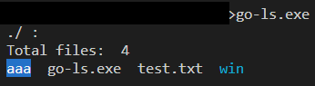
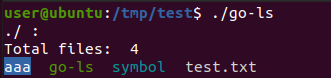
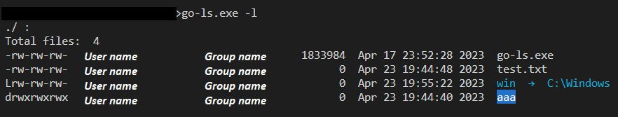
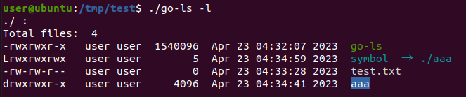
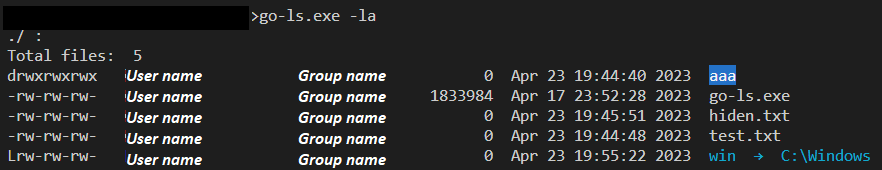
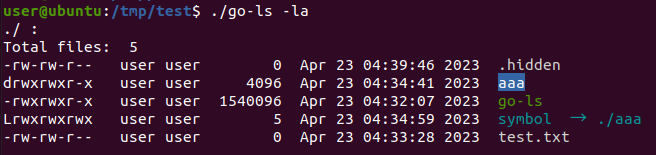

# go-ls
A simple "ls" implementation in Go for windows/linux

## Usage
```
> ./go-ls [filepath1 filepath2 ...]
Usage of go-ls:
  -a    list all files including hidden file starting with '.'
  -l    list with long format - show permissions
```

## Example
Display in a short format.
```
> go-ls.exe ./ ./README.md
./ :
Total files:  8
README.md  go.mod  go-ls  go-ls.exe  main.go  print.go  utils_linux.go  utils_windows.go

./README.md :
Total files:  1
README.md
```
* Windows


* Linux 



Display in a long format.
```
> go-ls.exe -l ./README.md   
./README.md :
Total files:  1
-rw-rw-rw-   1537  Mar 19 12:34:56 2023  README.md
```
* Windows


* Linux 



Display in a long format including hidden file.
```
> go-ls.exe -la ./
./ :
Total files:  10
-rw-rw-rw-  User Group/DomainName     1362  Mar 19 12:34:56 2023  README.md  
-rw-rw-rw-  User Group/DomainName       24  Mar 19 12:34:56 2023  go.mod
-rw-rw-rw-  User Group/DomainName  2174777  Mar 19 12:34:56 2023  go-ls
-rw-rw-rw-  User Group/DomainName  2302976  Mar 19 12:34:56 2023  go-ls.exe
drwxrwxrwx  User Group/DomainName        0  Mar 19 12:34:56 2023  hidden
-rw-rw-rw-  User Group/DomainName        0  Mar 19 12:34:56 2023  hidden.txt
-rw-rw-rw-  User Group/DomainName      593  Mar 19 12:34:56 2023  main.go
-rw-rw-rw-  User Group/DomainName     1163  Mar 19 12:34:56 2023  print.go
-rw-rw-rw-  User Group/DomainName     1474  Mar 19 12:34:56 2023  utils_linux.go
-rw-rw-rw-  User Group/DomainName     1623  Mar 19 12:34:56 2023  utils_windows.go
```
* Windows


* Linux
